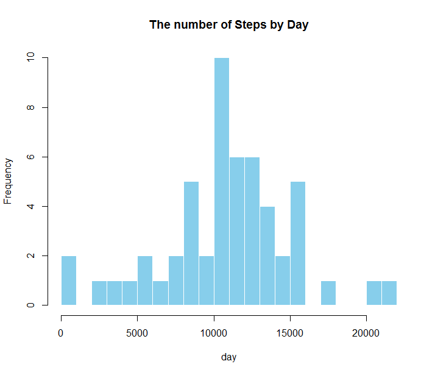
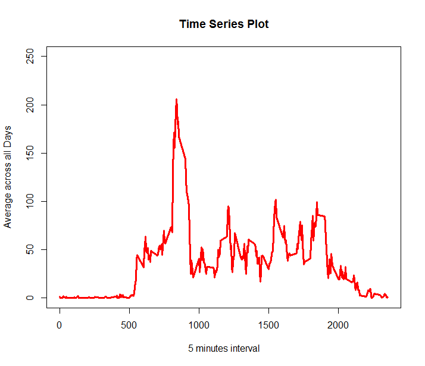
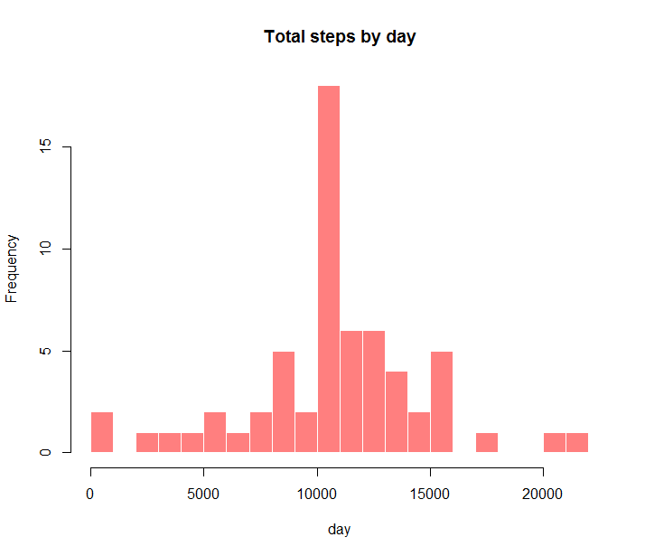

#Reproducible Research: Peer Assessment 1
This R Markdown document is Bill Seliger’s submission for Reproducible Research Peer Assessment 1. The course assignment can be found here https://class.coursera.org/repdata-010/human_grading/view/courses/973511/assessments/3/submissions

This assignment makes use of data from a personal activity monitoring device. This device collects data at 5 minute intervals throughout the day. The data consists of two months of data from an anonymous individual collected during the months of October and November, 2012 and include the number of steps taken in 5 minute intervals each day. The original dataset can be found here https://d396qusza40orc.cloudfront.net/repdata%2Fdata%2Factivity.zip

The variables included in this dataset are:

```{r simulate_data}
x <- rnorm(100)
y <- 2*x + rnorm(100)
```

steps: Number of steps taking in a 5-minute interval (missing values are coded as NA)
date: The date on which the measurement was taken in YYYY-MM-DD format
interval: Identifier for the 5-minute interval in which measurement was taken The dataset is stored in a comma-separated-value (CSV) file and there are a total of 17,568 observations in this dataset.

## Loading and preprocessing the data
Load the data into R
```r
activity <- read.csv("C:/Users/jiaqi/Desktop/activity.csv")
View(activity)
```
Transfer the data into propriate format for analyzing. The date on which the measurement was taken in YYYY-MM-DD format interval.

```r
activity$date <- as.Date(activity$date, "%Y-%m-%d")
```

## What is mean total number of steps taken per day?

First is using aggregate function
```r
Total_steps=aggregate(steps ~ date, data = activity, sum, na.rm = TRUE)
```
Then construct a histogram for total number steps taken per day
```r
hist(Total_steps$steps, main = "The number of Steps by Day", xlab = "day", col="skyblue", border=F,  breaks=20)
```


And then calculate the median and average value 

```r
Average=mean(Total_steps$steps)
Average
## [1] 10766.19
Median=median(Total_steps$steps)
Median
## [1] 10765
```

So the mean is 10766.19 and median is 10765


## What is the average daily activity pattern?
Make a time series plot (i.e. type = “l”) of the 5-minute interval (x-axis) and the average number of steps taken, averaged across all days (y-axis)
Now I get mean of steps and time series plot
time_series=tapply(activity$steps, activity$interval, mean, na.rm = TRUE)
The plot is:
```r
plot(row.names(time_series), time_series, type = "l", xlab = "5 minutes interval", 
+      ylab = "Average across all Days", main = "Time Series Plot", 
+      col = "red", lwd=3, ylim=c(0,250))
```


Which 5-minute interval, on average across all the days in the dataset, contains the maximum number of steps?
```r
max_value=which.max(time_series)
max_value
## [1] "835"
```


## Imputing missing values

First, we need to find out the number of missing values in the data. (missing values are coded as NA)

```r
Missing_values=sum(is.na(activity))
Missing_values
## [1] 2304
```
Devise a strategy for filling in all of the missing values in the dataset. The strategy does not need to be sophisticated. For example, you could use the mean/median for that day, or the mean for that 5-minute interval,etc
Fist Na replaced by mean in 5 min interval
```r
StepsAverage=aggregate(steps ~ interval, data = activity, FUN = mean)
fillNA=numeric()
for (i in 1:nrow(activity)) {
    obs=activity[i, ]
    if (is.na(obs$steps)) {
        steps=subset(StepsAverage, interval == obs$interval)$steps
    } else {
        steps=obs$steps
    }
    fillNA=c(fillNA, steps)
}
```
Create a new dataset that is equal to the original dataset but with the missing data filled in.
```r
new_activity=activity
new_activity$steps=fillNA
```
Make a histogram of the total number of steps taken each day and Calculate and report the mean and median total number of steps taken per day. Do these values differ from the estimates from the first part of the assignment? What is the impact of imputing missing data on the estimates of the total daily number of steps?
```r
Total_steps2=aggregate(steps ~ date, data = new_activity, sum, na.rm = TRUE)
```

Here is the histogram after missing data imported 
```r
hist(Total_steps2$steps, main = "Total steps by day", xlab = "day", col=scales::alpha('red',.5), breaks=20, border = F)
```


And the mean and median is
```r
mean(Total_steps2$steps)
## [1] 10766
median(Total_steps2$steps)
## [1] 10766
```
After replacing the mean is the same but the median is a little bit different


## Are there differences in activity patterns between weekdays and weekends?

For this part the weekdays() function may be of some help here. Use the dataset with the filled-in missing values for this part.
Create a new factor variable in the dataset with two levels ,weekday and weekend, indicating whether a given date is a weekday or weekend day.
```r
day=weekdays(activity$date)
daylevel=vector()
for (i in 1:nrow(activity)) {
    if (day[i] == "Saturday") {
        daylevel[i]="Weekend"
    } else if (day[i] == "Sunday") {
        daylevel[i]="Weekend"
    } else {
        daylevel[i]="Weekday"
    }
}
activity$daylevel=daylevel
activity$daylevel=factor(activity$daylevel)
```
```r
stepsByDay=aggregate(steps ~ interval + daylevel, data = activity, mean)
names(stepsByDay)=c("interval", "daylevel", "steps")
```


Now we can contruct a panel plot containing to see the relationship between the 5-minute interval and the average number of steps  and averaged across all weekday days or weekend days. The plot should look something like the following, which was creating using simulated data:
```r
xyplot(steps ~ interval | daylevel, stepsByDay, type = "l", layout = c(1, 2), 
    xlab = "Interval", ylab = "Number of steps")
```

